# CareFlow AI — Entity Relationship Diagram (ERD)

CareFlow AI centers around an append-only **Patient Timeline** (`timeline_events`). Clinical actions (diagnoses, medications, administration records, vitals, shift handoffs, tasks, file attachments) are automatically converted into chronological timeline events. Corrections refer back to previous events (`corrects_event_id`) to preserve append-only immutability.

```mermaid
erDiagram
    users ||--o{ patients : "assigned_doctor"
    users ||--o{ patients : "assigned_nurse"
    users ||--o{ patient_access : "has_access_to"
    users ||--o{ timeline_events : "created_by"
    users ||--o{ diagnoses : "diagnosed_by"
    users ||--o{ medications : "prescribed_by"
    users ||--o{ medication_administration : "administered_by"
    users ||--o{ vitals : "recorded_by"
    users ||--o{ shift_handoffs : "from_nurse"
    users ||--o{ shift_handoffs : "to_nurse"
    users ||--o{ tasks : "created_by_doctor"
    users ||--o{ tasks : "assigned_nurse"
    users ||--o{ ai_prompt_history : "requested_by"
    users ||--o{ file_attachments : "uploaded_by"
    users ||--o{ audit_logs : "performed_by"

    patients ||--o{ patient_access : "granted_access"
    patients ||--o{ timeline_events : "has_events"
    patients ||--o{ diagnoses : "has_diagnoses"
    patients ||--o{ medications : "has_prescriptions"
    patients ||--o{ vitals : "has_vitals"
    patients ||--o{ shift_handoffs : "has_handoffs"
    patients ||--o{ tasks : "has_tasks"
    patients ||--o{ ai_prompt_history : "has_ai_logs"
    patients ||--o{ file_attachments : "has_files"
    patients ||--o{ appointments : "has_appointments"

    medications ||--o{ medication_administration : "has_administrations"

    users {
        uuid id PK
        string email UK
        string password_hash
        string full_name
        string role "DOCTOR | NURSE | CAREGIVER | ADMIN | READ_ONLY"
        timestamp created_at
    }

    patients {
        uuid id PK
        string mrn UK
        string name
        date dob
        string gender
        string contact_info
        uuid assigned_doctor_id FK
        uuid assigned_nurse_id FK
        timestamp created_at
    }

    patient_access {
        uuid patient_id PK,FK
        uuid user_id PK,FK
        string relationship "FAMILY | PRIMARY_CAREGIVER"
    }

    timeline_events {
        uuid id PK
        uuid patient_id FK
        string event_type "DIAGNOSIS | MEDICATION | MEDICATION_ADMINISTRATION | VITAL | SHIFT_HANDOFF | CRITICAL_ALERT | APPOINTMENT | FILE_UPLOAD | TASK"
        text description
        uuid corrects_event_id FK
        uuid created_by FK
        timestamp created_at
    }

    diagnoses {
        uuid id PK
        uuid patient_id FK
        uuid doctor_id FK
        string condition
        text notes
        timestamp diagnosed_at
    }

    medications {
        uuid id PK
        uuid patient_id FK
        uuid prescribed_by FK
        string name
        string dosage
        string frequency
        date start_date
        date end_date
        string status "ACTIVE | DISCONTINUED | COMPLETED"
    }

    medication_administration {
        uuid id PK
        uuid medication_id FK
        uuid administered_by FK
        timestamp administered_at
        string status "GIVEN | MISSED | REFUSED"
        text notes
    }

    vitals {
        uuid id PK
        uuid patient_id FK
        uuid recorded_by FK
        string type "BLOOD_PRESSURE | SUGAR | TEMPERATURE | OXYGEN"
        string value
        timestamp recorded_at
    }

    shift_handoffs {
        uuid id PK
        uuid patient_id FK
        uuid from_nurse_id FK
        uuid to_nurse_id FK
        text notes
        text pending_tasks
        text observations
        text completed_tasks
        text next_shift_instructions
        text ai_summary
        date shift_date
    }

    tasks {
        uuid id PK
        uuid patient_id FK
        uuid created_by_doctor_id FK
        uuid assigned_nurse_id FK
        string title
        text description
        timestamp due_at
        string status "PENDING | IN_PROGRESS | COMPLETED | CANCELLED"
        timestamp created_at
        timestamp completed_at
    }

    ai_prompt_history {
        uuid id PK
        uuid patient_id FK
        uuid user_id FK
        string feature_name
        text prompt
        text retrieved_context
        text ai_response
        string response_status "SUCCESS | ERROR"
        timestamp created_at
    }

    file_attachments {
        uuid id PK
        uuid patient_id FK
        uuid uploaded_by FK
        string cloudinary_url
        string file_name
        string mime_type
        long size
        timestamp uploaded_at
    }

    appointments {
        uuid id PK
        uuid patient_id FK
        uuid doctor_id FK
        timestamp scheduled_at
        string status "SCHEDULED | COMPLETED | CANCELLED"
    }

    notifications {
        uuid id PK
        uuid user_id FK
        string type "CRITICAL_VITAL | MISSED_MEDICATION | HANDOFF_ASSIGNED | TASK_ASSIGNED"
        text message
        boolean read
        timestamp created_at
    }

    audit_logs {
        uuid id PK
        uuid user_id FK
        string action
        string entity_type
        uuid entity_id
        timestamp timestamp
        text metadata
    }
```

